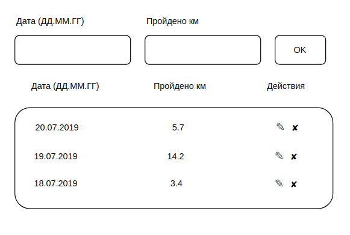

# Работа с формами

[](https://ci.appveyor.com/project/RomanMenshikov92/ra-16-react-working-with-forms)

[](https://github.com/RomanMenshikov92/ra-16-react-working-with-forms/actions/workflows/pages/pages-build-deployment)

---

## [GutHub Pages](https://romanmenshikov92.github.io/ra-16-react-working-with-forms/)

Необходимо выполнить и предоставить на проверку следующие задачи:

<details>
<summary>1. Конвертер цветов</summary>

# Конвертер цветов из HEX в RGB

Вам необходимо разработать конвертер цветов из HEX в RGB:


## Интерфейс конвертера

При правильном вводе цвета он показывает его представление в формате RGB и меняет цвет фона на заданный:


Конвертер при вводе неправильного цвета в формате HEX должен сообщать об ошибке:


Необходимо дожидаться ввода всех семи символов, включая решётку, чтобы принимать решение о том, показывать ошибку или менять цвет фона.

</details>

<details>
<summary>2. Учёт тренировок</summary>

# Учёт тренировок

Вы решили реализовать небольшое приложение, которое хранит данные о тренировках и прогулках, которые вы совершаете в течение недели.

Общий интерфейс должен выглядеть следующим образом:



## Добавление данных

У вас должна быть форма ввода, в которую вводится дата и количество пройденных километров. Новые значения добавляются в таблицу при отправке формы.

_Особенности добавления_:

1. Новые значения добавляются не в конец, а согласно сортировке по дате, то есть если мы добавим 21.07.2019, то значение встанет на первую позицию, согласно скриншоту, а если 17.07.2019 — то на последнюю.
2. Если мы добавляем значения, указывая уже существующую дату, то значения суммируются с теми, что хранятся в таблице, например, если добавить 20.07.2019 и 10 км, то для даты 20.07.2019 будет отображаться 15.7 км.

## Удаление данных

С помощью иконки ✘ должна быть возможность удалить строку. Удаляется вся строка целиком и данные, связанные с ней.

## Редактирование данных

Дополнительное, необязательное задание: вы можете реализовать кнопку редактирования ✎, при нажатии на которую происходит перенос данных в форму ввода с последующим сохранением при нажатии кнопки Ok.

</details>

<details>
<summary>3. Менеджер фото — необязательная задача</summary>

# Менеджер фото

Вы решили модернизировать один из старых проектов и переписать его в виде React-компонентов:


## Интерфейс Менеджера фото

При клике на области «Click to select» должно появляться стандартное окно выбора файлов операционной системы, в котором пользователь может выбрать один или несколько файлов изображений (image/\*).

После выбора файлов они автоматически загружаются и отображаются в виде preview фиксированного размера (нижний блок). Для отображения используйте DataURL. Новые файлы должны добавляться, а не заменять предыдущие.

При клике на крестик, изображение и все связанные с ним данные должны удаляться.

Важно: Drag & Drop реализовывать не нужно.

## Подсказки

1. Разместите с помощью CSS блок "Click to select" над `<input type="file" />` и установите этому блоку `pointer-events: none;`, чтобы вызывать окошко выбора файлов при клике.
1. Используйте следующую заготовку для получения DataUrl:

```js
const fileToDataUrl = (file) => {
  return new Promise((resolve, reject) => {
    const fileReader = new FileReader();

    fileReader.addEventListener("load", (evt) => {
      resolve(evt.currentTarget.result);
    });

    fileReader.addEventListener("error", (evt) => {
      reject(new Error(evt.currentTarget.error));
    });

    fileReader.readAsDataURL(file);
  });
};

const handleSelect = async (evt) => {
  const files = [...evt.target.files];
  const urls = await Promise.all(files.map((o) => fileToDataUrl(o)));
  // У вас в массиве - dataUrl, можете использовать в качестве значения атрибута src тега img
};
```

</details>
</br>

---

Любые вопросы по решению задач задавайте в группе в Discord.

Все три задачи лучше сдавать в разных репозиториях, то есть через create-react-app реализовать три проекта, чтобы не было конфликта стилей. Но если вы позаботитесь о том, что конфликта не будет, то можете сдавать и в одном проекте.

Все стили необходимо размещать в файле App.css.

#### Важно!

Задачи должны быть написаны на TypeScript. Все Props должны иметь свой тип или интерфейс. Использование типа any не допускается.

#### Альтернативный способ создания приложения React с использованием тулинга Vite

Приложение также можно создать используя инструмент Vite.
Документация по созданию приложения [React](https://vitejs.dev/guide/).

1. Откройте терминал и пропишите следующую команду: `yarn create vite my-app --template react`,
   либо `yarn create vite my-app --template react-ts`, если
   нужен шаблон с TypeScript. Эта команда создаст настроенный
   шаблонный проект.
2. Откройте созданный проект в своей IDE.
3. Установите зависимости.
4. Готово. Чтобы запустить приложение, введите команду: `yarn dev`(либо `npm run dev`).
